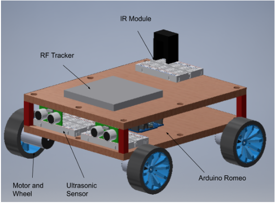

# OutsideTheBox

> An Arduino project that makes an Autonomous Over-Sand-Vehicle detect an infrared-emitting black box

This project involved building an Over-Sand-Vehicle from scratch using 3D printed/purchased materials. The aim of the project was to build a working model in under $100 that sucessfully navigated the sand-pit to search for the infrared-emitting black box and transmit its location to the RF system.

The final model looked like this:
    

### Contributions

- Implemented entire code for successful Over-Sand-Vehicle manoeuvring mechanism and black box detection
- Made critical design choices about placement of wheels, ultrasonic and infrared sensors, and wheel size and axles
- Created wiring schematics for the *Arduino Romeo*, used to interact with OSV and sensors

